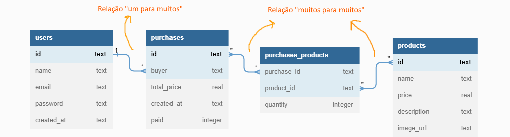

# **Labecommerce-Backend**

Labecommerce-Backend é o projeto de uma API desenvolvida para um e-commerce, com operações CRUD relacionadas a usuários, produtos e pedidos, vinculados ao banco de dados SQLite.

## **Documentação da API:**

[Clique aqui!](https://documenter.getpostman.com/view/25826777/2s93XyUiZw)

## **Funcionalidades do Projeto**

- [x] Cadastrar um novo usuário;
- [x] Vizualizar todos os usuários cadastrados;
- [x] Editar informações do usuário;
- [x] Deletar um usuário existente;
- [x] Cadastrar um novo produto;
- [x] Vizualizar todos os produtos cadastrados;
- [x] Vizualizar informações de um produto existente;
- [x] Pesquisar produto pelo nome;
- [x] Editar informações de um produto existente;
- [x] Deletar um produto existente;
- [x] Cadastrar um novo pedido;
- [x] Vizualizar os pedidos realizado por um usuário;
- [x] Vizualizar os dados de um pedido, incluindo a lista de produtos do mesmo;
- [x] Deletar um pedido existente.

## **Estrutura do Banco de Dados**



## **Tecnologias Utilizadas**

- Node.js
- Typescript
- Express
- Knex
- SQLite

## **Programas utilizados**

- VS Code
- Postman

## **Como rodar este projeto?**

```bash
# Clone este repositório
$ git clone https://github.com/AnaliceMarques/labecommerce-backend.git

# Acesse a pasta do projeto no seu terminal
$ cd labecommerce-backend

# Instale as dependências
$ npm install

# Execute a aplicação no servidor
$ npm run dev

# A aplicação será iniciada na porta 3003

# Use um API Client para testar as rotas da aplicação
```

## **Próximos passos**

- [] Testes unitários;
- [] Deploy.

## **Contato**

e-mail: analicemarquessl@gmail.com

Linkedin: https://www.linkedin.com/in/analicemarquessl
